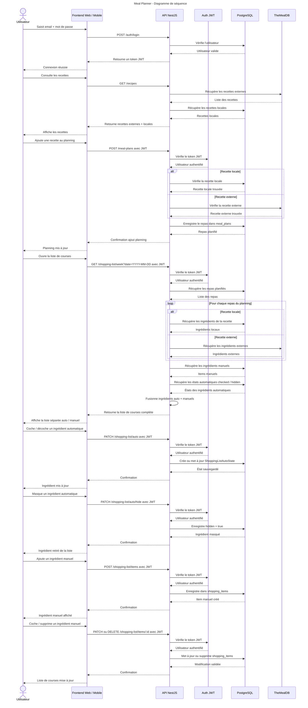

# Diagramme de séquence — Meal Planner

Ce diagramme représente le flux principal de l'application :

- Connexion utilisateur
- Consultation des recettes
- Ajout d’une recette au planning
- Génération de la liste de courses
- Gestion des ingrédients automatiques et manuels

## Diagramme Mermaid

## Description

Le frontend web et l’application mobile communiquent avec une API NestJS.

Les données proviennent de deux sources :

- PostgreSQL pour les utilisateurs, recettes locales, planning et liste de courses
- TheMealDB pour les recettes externes

La liste de courses fusionne :

- les ingrédients automatiques issus du planning
- les ingrédients manuels ajoutés par l’utilisateur

Les ingrédients automatiques ne sont pas supprimés directement : un système d’état permet de les cocher ou de les masquer.
